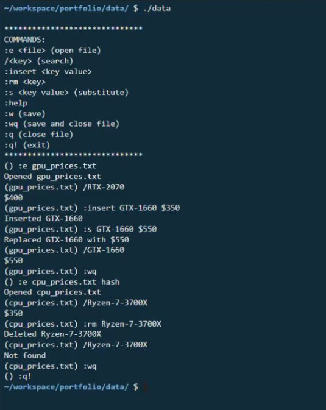

[![Contributors][contributors-shield]][contributors-url]
[![Forks][forks-shield]][forks-url]
[![Stargazers][stars-shield]][stars-url]
[![Issues][issues-shield]][issues-url]
[![MIT License][license-shield]][license-url]
[![LinkedIn][linkedin-shield]][linkedin-url]

<!-- PROJECT LOGO -->
<br />
    
<p align="center">
  <a href="https://github.com/cjoshi7/DS-Emacs">
    
  </a>

  <h1 align="center">Data Structure Editing Macros</h1>

  <p align="center">
    Edit abstract data structures through vim-inspired commands on the terminal
    <br />
    <a href="https://github.com/cjoshi7/DS-Emacs"><strong>Explore the docs »</strong></a>
    <br />
    <br />
    <a href="https://youtu.be/r9-8qcNwKmk">View Demo</a>
    ·
    <a href="https://github.com/cjoshi7/DS-Emacs">Report Bug</a>
    ·
    <a href="https://github.com/cjoshi7/DS-Emacs">Request Feature</a>
  </p>
</p>

<!-- TABLE OF CONTENTS -->
<details open="open">
  <summary>Table of Contents</summary>
  <ol>
    <li>
      <a href="#about-the-project">About The Project</a>
    </li>
    <li>
      <a href="#getting-started">Getting Started</a>
      <ul>
        <li><a href="#prerequisites">Prerequisites</a></li>
        <li><a href="#installation">Installation</a></li>
      </ul>
    </li>
    <li><a href="#usage">Usage</a></li>
    <li><a href="#roadmap">Roadmap</a></li>
    <li><a href="#contributing">Contributing</a></li>
    <li><a href="#contact">Contact</a></li>
    <li><a href="#acknowledgements">Acknowledgements</a></li>
  </ol>
</details>


<!-- ABOUT THE PROJECT -->
## About The Project

### Inspiration
While exploring the C++ standard template library, I became curious enough to want to implement some of the containers and iterators myself, so I created a set of editing macros that manage big data sets in the fastest asymptotic time possible.

### What it does
This application allows the user to manipulate big data sets with vim-inspired macros in the terminal. They choose between a trie for O(1) search, insertion, and deletion, or hashmap for O(n) search and deletion and O(1) insertion.

### How I built it
Only the C++ standard library is used to implement all features. All memory is manually allocated and freed per the standard template library implementations.

### Challenges I ran into
It was quite frustrating to manage every single part of memory through the segfaults and lost memory sectors duing the development cycle, but the end product is a very optimized set of data editing macros. I learned about data structures and search/insertion/deletion algoritms in the process.

## Getting Started

### Installation

1. Clone the repo
   ```sh
   git clone https://github.com/cjoshi7/DS-Emacs
   ```
2. Run the precompiled binary
   ```sh
   ./DS-Emacs/data <txt file name>
   ```


<!-- USAGE EXAMPLES -->
## Usage

<p align="center">
  <a href="https://github.com/cjoshi7/DS-Emacs">
    
  </a>
</p>

The following commands have been implemented to edit data structures:
```
:e <file> (open text file to edit)
/<key> (search for key)
:insert <key value>
:rm <key>
:s <key value> (substitute new value for key)
:help
:w (save changes)
:wq (save changes and close file)
:q (close file)
:q! (exit)
```

_For more examples, please refer to the [Documentation](https://github.com/cjoshi7/meteorological-query-tool)_


<!-- ROADMAP -->
## Roadmap

__See the [open issues](https://github.com/cjoshi7/DS-Emacs) for a list of proposed features (and known issues).__

Fix potential segmentation faults while unloading full data structure and exporting changes.

<!-- CONTRIBUTING -->
## Contributing

Any contributions to extend features are **greatly appreciated**.

1. Fork the Project
2. Create your Feature Branch (`git checkout -b feature/newFeature`)
3. Commit your Changes (`git commit -m 'Add NewFeature'`)
4. Push to the Branch (`git push origin feature/newFeature`)
5. Open a Pull Request

<!-- CONTACT -->
## Contact

Chinar Joshi - chinarjoshi7@gmail.com

Project Link: [https://github.com/cjoshi7/covid19-date-selector](https://github.com/cjoshi7/DS-Emacs)

<!-- ACKNOWLEDGEMENTS -->
## Acknowledgements
* [Binary Tree Icon](https://dndi.org/diseases/covid-19/target-product-profile/)
* [Readme Template](https://github.com/othneildrew/Best-README-Template)
* [Img Shields](https://shields.io)
* [GitHub Pages](https://pages.github.com)
* [Animate.css](https://daneden.github.io/animate.css)
* [Loaders.css](https://connoratherton.com/loaders)

<!-- MARKDOWN LINKS & IMAGES -->
<!-- https://www.markdownguide.org/basic-syntax/#reference-style-links -->
[contributors-shield]: https://img.shields.io/github/contributors/chinarjoshi/DS-Emacs?style=for-the-badge
[contributors-url]: https://github.com/chinarjoshi/DS-Emacs/graphs/contributors
[forks-shield]: https://img.shields.io/github/forks/chinarjoshi/DS-Emacs?style=for-the-badge
[forks-url]: https://github.com/chinarjoshi/DS-Emacs/network/members
[stars-shield]: https://img.shields.io/github/stars/chinarjoshi/DS-Emacs?style=for-the-badge
[stars-url]: https://github.com/chinarjoshi/DS-Emacs/stargazers
[issues-shield]: https://img.shields.io/github/issues/chinarjoshi/DS-Emacs?style=for-the-badge
[issues-url]: https://github.com/chinarjoshi/DS-Emacs/issues
[license-shield]: https://img.shields.io/github/license/chinarjoshi/DS-Emacs?style=for-the-badge
[license-url]: https://github.com/chinarjoshi/DS-Emacs/blob/master/LICENSE.txt
[linkedin-shield]: https://img.shields.io/badge/-LinkedIn-black.svg?style=for-the-badge&logo=linkedin&colorB=555
[linkedin-url]: https://www.linkedin.com/in/chinar-joshi-905493207/
[product-screenshot]: images/screenshot.png
